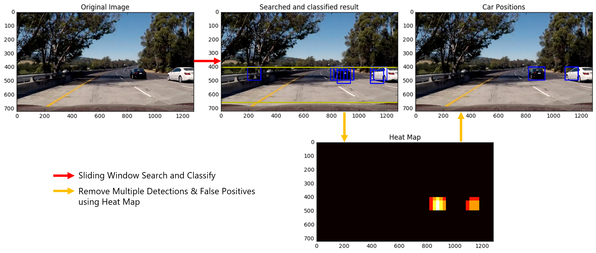

# Vehicle Detection
[](http://www.udacity.com/drive)


In this project, the goal is to write a software pipeline to **detect vehicles** in a video [`project_video.mp4`](./project_video.mp4). The project aims to detect the position of the vehicle in the image using **conventional methods** such as HOG(Histogram of Oriented Gradient) and SVM(Support Vector Machine).




Usage
---
### Dataset: Vehicles and Non-vehicles data
Udacity CarND provides datasets for vehicles and non-vehicles data to train classifier. It contains `8792` vehicle images and `8968` non-vehicle images. These datasets are comprised of images taken from the [GTI vehicle image database](http://www.gti.ssr.upm.es/data/Vehicle_database.html), the [KITTI vision benchmark suite](http://www.cvlibs.net/datasets/kitti/), and examples extracted from the project video itself.
* [Vehicles data](https://s3.amazonaws.com/udacity-sdc/Vehicle_Tracking/vehicles.zip) 
* [Non-vehicles data](https://s3.amazonaws.com/udacity-sdc/Vehicle_Tracking/non-vehicles.zip) 

### Train SVM Classifier
To train classifier, place images like:

```
    # for vehicle dataset:
    ./classifier_images/vehicles/xxx/yyy.png (folder/file name dosen't matter)

    # for non-vehicle dataset:
    ./classifier_images/non-vehicles/zzz/www.png 
    
```

then follow [`Training_Classifier.ipynb`]('./Training_Classifier.ipynb').

### Generate Video
To generate video, follow [`Generate_Video.ipynb`]('./Generate_Video.ipynb'). 


Vehicle Detection Pipeline
---

You can find all the detail of vehicle detection pipeline on [`Vehicle_Detection_Pipeline.ipynb`](./Vehicle_Detection_Pipeline.ipynb).

The algorithm is structured as follows:
1. **Extracting Features** from images
    * `Spartially Binned Color`, `Color Histogram`, `HOG`
    * `skimage.feature.hog()` is used for extracting HOG features.
2. **Training** Classifier
    * `sklearn.svm.LinearSVC()` function is used.
3. **Searching** Using Sliding Window and **Classifying** Each Window
    * `find_car()` function is used for searching and classifying.
4. Removing **Multiple Detections** and **False Positives**
    * `apply_threshold()` function and `scipy.ndimage.measurements.label()` function is used.


Result
---
It took `6 minutes` to process `50 second` video and generate the output video using `moviepy`. You can see full version of high resolution output video on Youtube: <a href="https://youtu.be/J6I3ph9pK-E" target="_blank">`output_video`</a>

| Input | Result |
|:-----------------:|:----------------:|
|     |       |

Discussion
---
### Accuracy and Robustness
The accuracy of the classifier that distinguishes between vehicle and non-vehicle is about **98%**. However, false possitives appear many times. I could reduce these false positives by using the **previous frame's heatmap**, but I could not remove them completely as shown in the image below. This false positive will be fatal when this detection algorithm is used for control the vehicle because The algorithm recognizes the empty road as obstacle.

<div style="text-align:center"></div>

### Additional Readings
This project used a classic method of detecting vehicles in images. but state-of-the-art vehicle detection methods are proposed these days. In the future, I will apply the following techniques to this video.

* [SSD (Single Shot MultiBox Detector), 2015](https://arxiv.org/abs/1512.02325)
* [YOLO (You Only Look Once), 2016](https://arxiv.org/abs/1612.08242)


